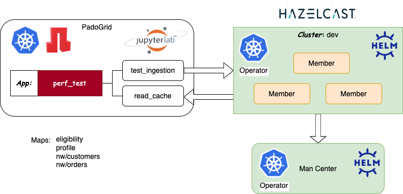

 [*PadoGrid*](https://github.com/padogrid) | [*Catalogs*](https://github.com/padogrid/catalog-bundles/blob/master/all-catalog.md) | [*Manual*](https://github.com/padogrid/padogrid/wiki) | [*FAQ*](https://github.com/padogrid/padogrid/wiki/faq) | [*Releases*](https://github.com/padogrid/padogrid/releases) | [*Templates*](https://github.com/padogrid/padogrid/wiki/Using-Bundle-Templates) | [*Pods*](https://github.com/padogrid/padogrid/wiki/Understanding-Padogrid-Pods) | [*Kubernetes*](https://github.com/padogrid/padogrid/wiki/Kubernetes) | [*Docker*](https://github.com/padogrid/padogrid/wiki/Docker) | [*Apps*](https://github.com/padogrid/padogrid/wiki/Apps) | [*Quick Start*](https://github.com/padogrid/padogrid/wiki/Quick-Start)

---

<!-- Platforms -->
[](https://github.com/padogrid/padogrid/wiki/Platform-PadoGrid-1.x) [](https://github.com/padogrid/padogrid/wiki/Platform-Host-OS) [](https://github.com/padogrid/padogrid/wiki/Platform-Kubernetes)

# Hazelcast Kubernetes Operator

This bundle provides step-by-step instructions for deploying and testing Hazelcast Platform Operator, Hazelcast, and PadoGrid.



## Installing Bundle

```bash
install_bundle -download bundle-hazelcast-5-k8s-operator
```

## Use Case

This bundle installs PadoGrid and Hazelcast containers on Kubernetes using the [Hazelcast Platform Operator](https://docs.hazelcast.com/operator/latest/). It demonstrates the Padogrid's `perf_test` app to ingest mock data into Hazelcast.

## Required Software

- [Kubernetes CLI](https://kubernetes.io/docs/reference/kubectl/kubectl/), **`kubectl`**
- [Helm](https://helm.sh/docs/intro/install/), **`helm`**

## Bundle Contents

```console
k8s
└── hz_operator
    ├── bin_sh
    │   ├── setenv.sh
    │   ├── start_padogrid
    │   └── stop_padogrid
    ├── hazelcast
    │   ├── hazelcast-enterprise.yaml
    │   ├── hazelcast.yaml
    │   ├── managementcenter-enterprise.yaml
    │   └── managementcenter.yaml
    └── padogrid
        ├── padogrid-configmap-enterprise.yaml
        ├── padogrid-configmap-oss.yaml
        └── padogrid.yaml
```

---

## Installing Hazelcast Operator - Helm Charts

### 1. Add the Hazlecast Helm Charts repository to your Helm repository list.

```bash
helm repo add hazelcast https://hazelcast-charts.s3.amazonaws.com/
helm repo update
```

### 2. Deploy the Operator and the CRDs. By default, the Hazelcast Platform Operator watches all namespaces.

```bash
helm install operator hazelcast/hazelcast-platform-operator --version=5.11.0 \
    --set=installCRDs=true
```

Output:

```yaml
NAME: operator
LAST DEPLOYED: Thu Apr 18 14:53:06 2024
NAMESPACE: hz-operator
STATUS: deployed
REVISION: 1
TEST SUITE: None
```

### 3. View all configuration options.

```bash
helm show values hazelcast/hazelcast-platform-operator
```

Output:

```yaml
# Default values for hazelcast-platform-operator.
# This is a YAML-formatted file.
# Declare variables to be passed into your templates.

image:
  imageOverride: ""
  repository: hazelcast/hazelcast-platform-operator
  pullPolicy: IfNotPresent
  # Overrides the image tag whose default is the chart appVersion.
  tag:
  pullSecrets: []

developerModeEnabled: false
phoneHomeEnabled: true

# Guard field to make sure no clusterrole permission is used when deploying the operator.
# If false and Helm is misconfigured, it will fail the release.
createClusterScopedResources: true
webhook:
  enabled: true
# List of watched namespaces, by default operator watches all namespaces
# If [], [""] or ["*"] operator will watch every namespace.
watchedNamespaces: ["*"]
# If true, create ClusterRole and ClusterRoleBinding for getting node resources.
enableHazelcastNodeDiscovery: true
installCRDs: true

debug:
  enabled: false
  port: 40000

## DEPRECATED: Use 'image.pullSecrets' instead of imagePullSecrets.
# imagePullSecrets: []
nameOverride: ""
fullnameOverride: ""

serviceAccount:
  # Specifies whether a service account should be created
  create: true
  # Annotations to add to the service account
  annotations: {}
  # The name of the service account to use.
  # If not set and create is true, a name is generated using the fullname template
  name: ""

podAnnotations: {}

podSecurityContext:
  runAsNonRoot: true

securityContext:
  allowPrivilegeEscalation: false
  capabilities:
    drop:
      - ALL
  readOnlyRootFilesystem: true
  runAsNonRoot: true

service:
  type: ClusterIP
  port: 80

resources:
  # We usually recommend not to specify default resources and to leave this as a conscious
  # choice for the user. This also increases chances charts run on environments with little
  # resources, such as Minikube. If you do want to specify resources, uncomment the following
  # lines, adjust them as necessary, and remove the curly braces after 'resources:'.
  limits:
    cpu: 200m
    memory: 300Mi
  requests:
    cpu: 100m
    memory: 100Mi

nodeSelector: {}

tolerations: []

affinity: {}
```

### 4. Monitor the operator logs.

```bash
kubectl logs deployment.apps/operator-hazelcast-platform-operator
```

Output:

```json
{"level":"info","ts":"2024-04-18T18:53:20Z","logger":"setup","msg":"Watching all namespaces"}
{"level":"info","ts":"2024-04-18T18:53:20Z","logger":"setup","msg":"setting up webhook server listeners for custom resources"}
...
{"level":"info","ts":"2024-04-18T18:53:20Z","msg":"Starting workers","controller":"wansync","controllerGroup":"hazelcast.com","controllerKind":"WanSync","worker count":1}
{"level":"info","ts":"2024-04-18T18:53:20Z","msg":"Starting workers","controller":"managementcenter","controllerGroup":"hazelcast.com","controllerKind":"ManagementCenter","worker count":1}
{"level":"info","ts":"2024-04-18T18:53:21Z","msg":"Starting workers","controller":"hazelcast","controllerGroup":"hazelcast.com","controllerKind":"Hazelcast","worker count":1}
```

---

## Startup Sequence

### 1. Change Kubernetes Context

Change context to your Kubernetes environment.

Minikube:

```bash
kubectl config get-contexts
kubectl config use-context minikube
```

Docker Desktop Kubernetes:

```bash
kubectl config get-contexts
kubectl config use-context docker-desktop
```

3. Create Kubernetes Namespace

Let's create the `hz-operator` namespace. You can create a project with a different name but make sure to replace `hz-operator` with your namespace name throughout this article and set `NAMESPACE` in `hz_operator/bin_sh/setenv.sh`.

```bash
# Create namespace
kubectl create namespace hz-operator

# Switch namespace
kubectl config set-context --current --namespace=hz-operator
```

### 2. Build Local Environment

```bash
cd_k8s hz_operator/bin_sh
./build_app
```

### 3. Start Hazelcast

#### 3.1. Hazelcast Enterprise

```bash
# First, create a license key secret
kubectl create secret generic hazelcast-license-key --from-literal=license-key=<YOUR LICENSE KEY>
cd_k8s hz_operator/bin_sh
kubectl apply -f hazelcast/hazelcast-enterprise.yaml
```

#### 3.2. Hazelcast OSS

```bash
cd_k8s hz_operator/bin_sh
kubectl apply -f hazelcast/hazelcast.yaml
```

### 4. Start Padogrid

```bash
cd_k8s hz_operator/bin_sh
./start_padogrid
```

### 5. Login to Padogrid

#### 5.1. HTTP - External IP

The PadoGrid container is equipped with JupyterLab. From the browser, login to PadoGrid.

```bash
kubectl get svc padogrid-service
```

Output:

```console
NAME               TYPE           CLUSTER-IP      EXTERNAL-IP   PORT(S)                         AGE
padogrid-service   LoadBalancer   10.97.183.175   localhost     8888:32106/TCP,5006:30100/TCP   19s
```

If the external IP is not available, then you need to enable port-forwarding as follows.

```bash
kubectl port-forward svc/padogrid-service 8888:8888

    URL: http://localhost:8888
    Password: padogrid
```

- **URL:** http://localhost:8888
- **Password:** padogrid

#### 5.2. HTTP - Minikube

If you are using minikube, then you can expose the PadoGrid service via the `minikube service <service-name> --url` command as follows.

```bash
minikube service padogrid-service --url -n hz-operator
```

Output:

```console
http://127.0.0.1:54037
```

Enter the URL in the browser to open PadoGrid JupyterLab.

- **Password**: padogrid

### 5. Ingest Data

```bash
The `start_padogrid` script automatically sets the Hazelcast service and the namespace for constructing the DNS address needed by the `perf_test` app to connect to the Hazelcast cluster. This allows us to simply login to the PadoGrid pod and run the `perf_test` app.

*If `perf_test` fails to connect to the Hazelcst cluster then you may need to manually configure the Hazelcast client as described in the [next section](#9-manually-configuring-perf_test).*

Once logged in, from inside the Padogrid pod, run the `perf_test` app as follows.

```bash
# First, change cluster context to the default cluster, 'myhz' so
# that we can create and run Hazelcast apps.
switch_cluster myhz

# Create 'perf_test' app
create_app
cd_app perf_test/bin_sh

# Ingest blob data into Hazelcast
./test_ingestion -run
```

Read ingested data.

```bash
cd_app perf_test/bin_sh
./read_cache eligibility
./read_cache profile
```

The `elibility` and `profile` maps contain blobs. They are meant for carrying out performance tests with different payload sizes. If you want to ingest non-blobs, then you can ingest the Northwind (nw) data generated by PadoGrid. To do so, you must first build the `perf_test` app and run the `test_group` script as shown below.

```bash
cd_app perf_test/bin_sh
./build_app

# After the build, run test_group to ingest 'nw' data
./test_group -run -prop ../etc/group-factory.properties

# Query 'nw' data. You can use Grafana monitor query metrics.
./test_group -run -prop ../etc/group-query.properties
```

The `group-query.properties` file may fail since the mapping tables have not been created. You can create them from the Management Center or by executing the `hz-cli` command as follows.

First, get the cluster IP address by executing the following from your host OS.

```bash
kubectl get pod hazelcast-0 -o jsonpath='{.status.podIP}' && echo
```

Output:

```console
10.1.3.52
```

Run `hz-cli` with the cluster IP as follows.

```bash
hz-cli -t dev@10.1.3.52:5701 sql
```

Hazelcast SQL Console: Copy/paste the mapping table outputs as follows.

```console
Connected to Hazelcast 5.3.7 at [10.1.3.52]:5701 (+2 more)
Type 'help' for instructions
sql> CREATE OR REPLACE EXTERNAL MAPPING "hazelcast"."public"."nw/customers" EXTERNAL NAME "nw/customers"
TYPE "IMap"
OPTIONS (
  'keyFormat'='java',
  'keyJavaClass'='java.lang.String',
  'valueFormat'='portable',
  'valuePortableFactoryId'='1',
  'valuePortableClassId'='101',
  'valuePortableClassVersion'='1'
);
OK
sql> CREATE OR REPLACE EXTERNAL MAPPING "hazelcast"."public"."nw/orders" EXTERNAL NAME "nw/orders"
TYPE "IMap"
OPTIONS (
  'keyFormat'='java',
  'keyJavaClass'='java.lang.String',
  'valueFormat'='portable',
  'valuePortableFactoryId'='1',
  'valuePortableClassId'='109',
  'valuePortableClassVersion'='1'
);
OK
sql> exit;
```

Now, run the query test again.

```bash
cd_app perf_test/bin_sh
./test_group -run -prop ../etc/group-query.properties
```

The above command iteratively queries the `nw/customers` and `nw/orders` maps that have been indexed. To monitor the index metrics, select *Home/Dashboards/Hazelcast/Map Query Charts* from Grafana.


You can run the `read_cache` command to read the ingested data.

```bash
cd_app perf_test/bin_sh
./read_cache nw/customers
./read_cache nw/orders
```

### 6. Manually Configuring `perf_test`

The `test_ingestion` script may fail to connect to the Hazelcast cluster if you started the PadoGrid pod before the Hazelcast cluster is started. In that case, you can simply restart PadoGrid. If it still fails even after the Hazelcast cluster has been started first, then you can manually enter the DNS address in the `etc/hazelcast-client-k8s.xml` file as described below.

```bash
cd_app perf_test
vi etc/hazelcast-client-k8s.xml
```

### 6.1. Hazelcast Enterprise

Enter the following in the `etc/hazelcast-client-k8s.xml` file. `hz-operator-hazelcast-enterprise` is the service and  `hz-operator` is the project name.

```xml
                <kubernetes enabled="true">
                        <service-dns>hz-operator-hazelcast-enterprise.hz-operator.svc.cluster.local</service-dns>
                </kubernetes>
```

### 6.2. Hazelcast OSS

Enter the following in the `etc/hazelcast-client-k8s.xml` file. `hz-operator-hazelcast` is the service and  `hz-operator` is the project name.

```xml
                <kubernetes enabled="true">
                        <service-dns>hz-operator-hazelcast.hz-operator.svc.cluster.local</service-dns>
                </kubernetes>
```

## Teardown

### Hazelcast Enterprise

```bash
cd_k8s hz_operator/bin_sh
./stop_padogrid
kubectl delete -f hazelcast/hazelcast-enterprise.yaml
kubectl delete -f hazelcast/managementcenter-enterprise.yaml
kubectl delete secret hazelcast-license-key
kubectl delete namespaces hz-operator
```

### Hazelcast OSS

```bash
cd_k8s hz_operator/bin_sh
./stop_padogrid
kubectl delete -f hazelcast/hazelcast.yaml
kubectl delete -f hazelcast/managementcenter.yaml
kubectl delete namespaces hz-operator
```

---

 [*PadoGrid*](https://github.com/padogrid) | [*Catalogs*](https://github.com/padogrid/catalog-bundles/blob/master/all-catalog.md) | [*Manual*](https://github.com/padogrid/padogrid/wiki) | [*FAQ*](https://github.com/padogrid/padogrid/wiki/faq) | [*Releases*](https://github.com/padogrid/padogrid/releases) | [*Templates*](https://github.com/padogrid/padogrid/wiki/Using-Bundle-Templates) | [*Pods*](https://github.com/padogrid/padogrid/wiki/Understanding-Padogrid-Pods) | [*Kubernetes*](https://github.com/padogrid/padogrid/wiki/Kubernetes) | [*Docker*](https://github.com/padogrid/padogrid/wiki/Docker) | [*Apps*](https://github.com/padogrid/padogrid/wiki/Apps) | [*Quick Start*](https://github.com/padogrid/padogrid/wiki/Quick-Start)
